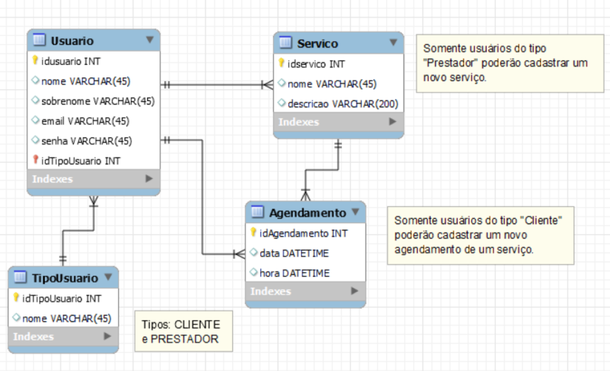

<h2>Projeto AgendaApp</h2>
 

  

 

<h2>Descrição do Projeto</h2>

Desenvolvimento em Spring Boot para a criação de um sistema de cadastro e agendamento de serviços oferecidos aos usuários, onde tivemos que implementar conceitos do padrão arquitetural Spring MVC, API REST e banco de dados MySQL.

<h2>Diagrama de Classes</h2>
 

  

 

<h2>Documentação Swagger</h2>

<a href="http://localhost:8080/swagger-ui/index.html">Link</a> para o Swagger UI.
